---
## Front matter
lang: ru-RU
title: Лабораторная работа №1
subtitle: Настройка рабочего окружения. Система контроля версий Git
author:
  - Федорова А. И.
institute:
  - Российский университет дружбы народов, Москва, Россия
date: 21 февраля 2026

## i18n babel
babel-lang: russian
babel-otherlangs: english

## Formatting pdf
toc: false
toc-title: Содержание
slide_level: 2
aspectratio: 169
section-titles: true
theme: metropolis
header-includes:
 - \metroset{progressbar=frametitle,sectionpage=progressbar,numbering=fraction}
---

# Информация

## Докладчик

  * Федорова Анжелика Игоревна
  * Студент
  * Российский университет дружбы народов
  * Предмет: Математическое моделирование

# Цель работы

## Цель

- Настроить рабочее окружение для работы с Git
- Создать репозиторий курса на основе шаблона
- Настроить SSH- и GPG-ключи
- Освоить работу с git flow

# Выполнение лабораторной работы

## Установка Quarto

Установка Quarto с помощью пакетного менеджера dnf.

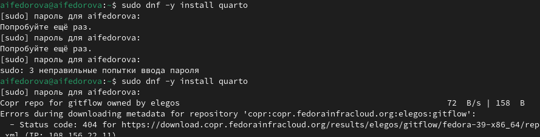{#fig-001 width=60%}

## Установка Node.js

Пакет nodejs уже был установлен в системе.

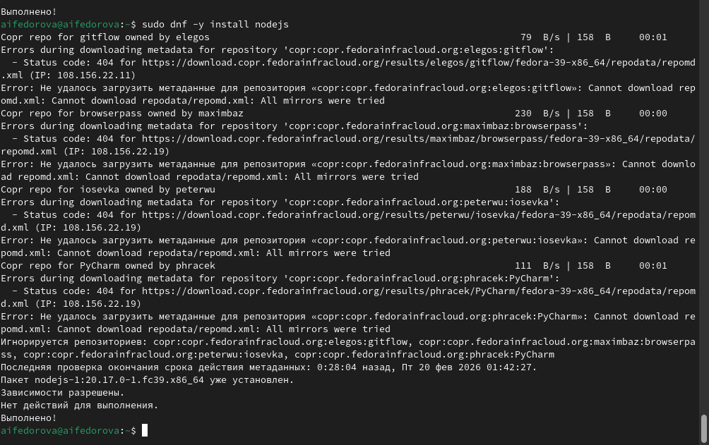{#fig-002 width=60%}

## Установка gitflow

Установка пакета gitflow для работы с моделью ветвления.

{#fig-003 width=60%}

## Создание репозитория на GitVerse

Создан публичный репозиторий `2026-1--study--simulation-modeling` на основе шаблона.

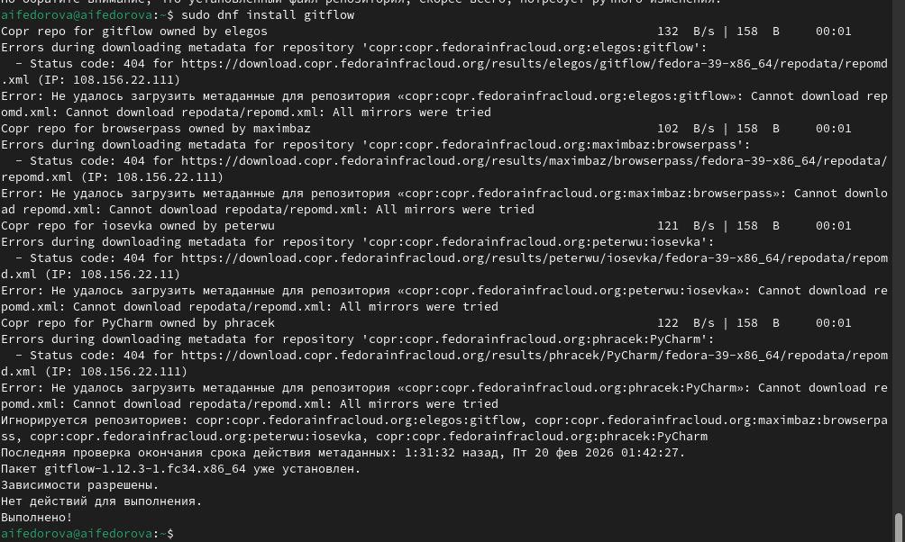{#fig-004 width=60%}

## Настройка SSH-ключа

SSH-ключ сгенерирован и добавлен в учётную запись GitVerse.

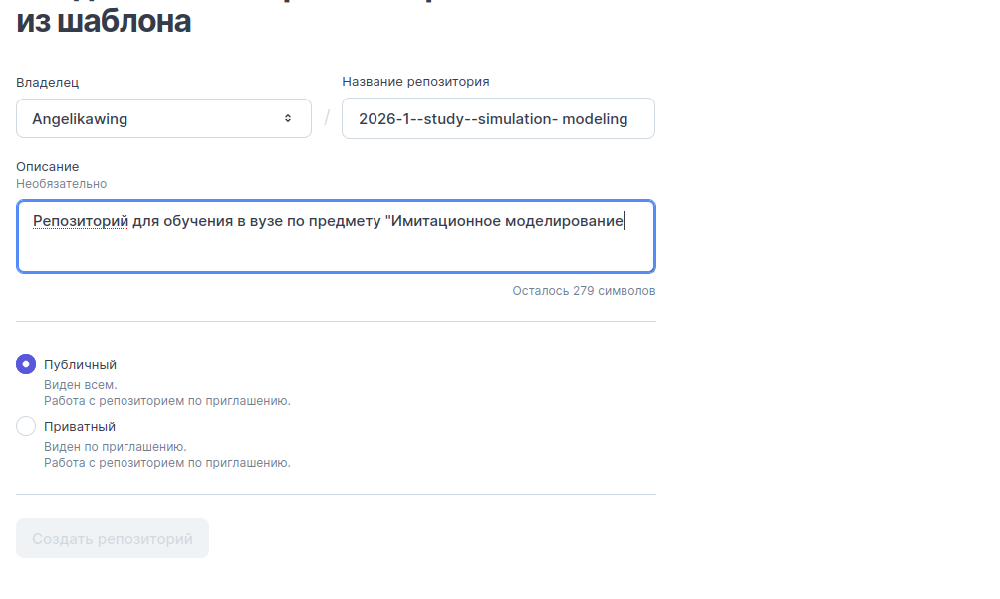{#fig-005 width=60%}

## Создание GPG-ключа

Сгенерирован GPG-ключ RSA 4096 бит для подписи коммитов.

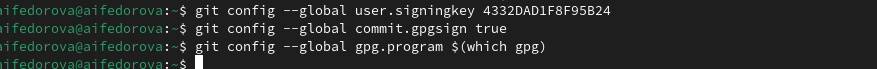{#fig-006 width=60%}

## Добавление GPG-ключа в GitVerse

GPG-ключ успешно добавлен в учётную запись.

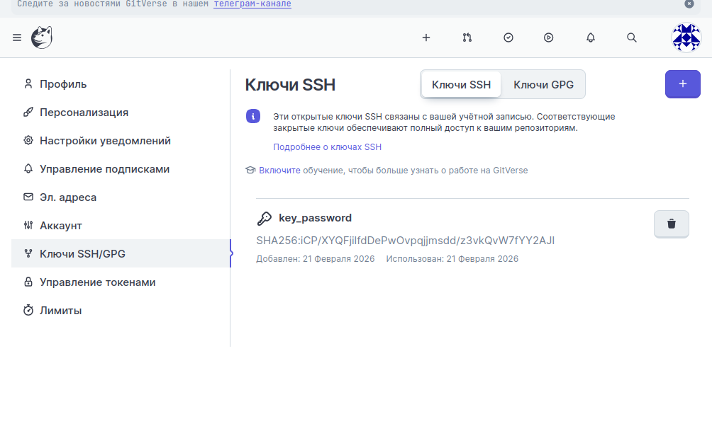{#fig-007 width=60%}

## Настройка подписи коммитов

Настроен git для автоматической подписи коммитов GPG-ключом.

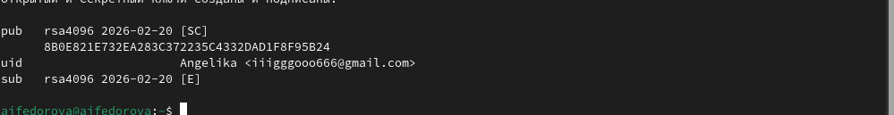{#fig-008 width=60%}

## Создание структуры курса

Выполнены `make prepare`, `git add`, `git commit` и `git push`.

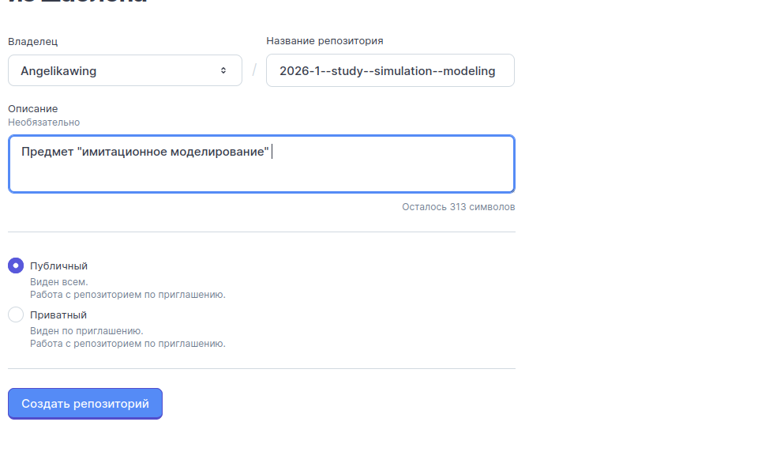{#fig-009 width=60%}

## Инициализация git flow

Выполнена команда `git flow init` с параметрами по умолчанию. Созданы ветки `master` и `develop`.

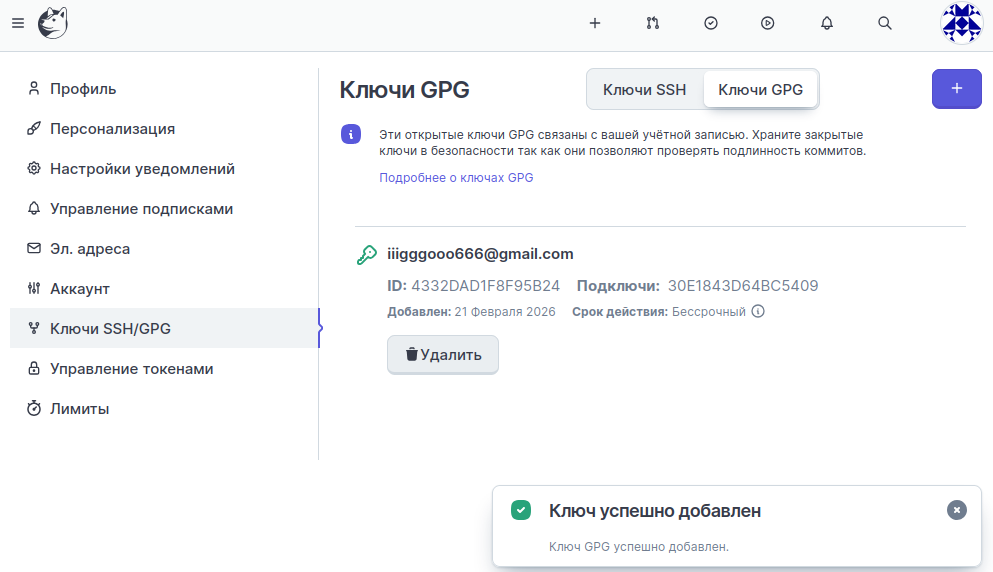{#fig-010 width=60%}

## Создание релиза

Создан релиз 1.0.0 и сгенерирован `CHANGELOG.md`.

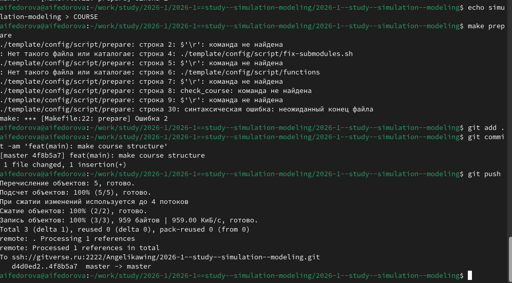{#fig-011 width=60%}

## Завершение релиза

Релиз завершён: слияние в `master`, тег `v1.0.0`, обратное слияние в `develop`.

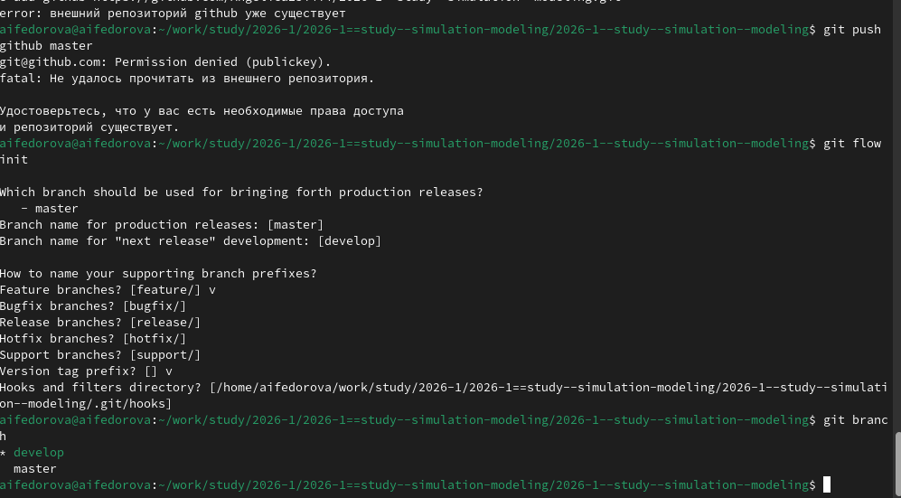{#fig-012 width=60%}

# Результаты

## Выводы

- Установлены Quarto, Node.js, gitflow
- Создан репозиторий курса на GitVerse
- Настроены SSH- и GPG-ключи
- Выполнена инициализация git flow
- Создан первый релиз v1.0.0
